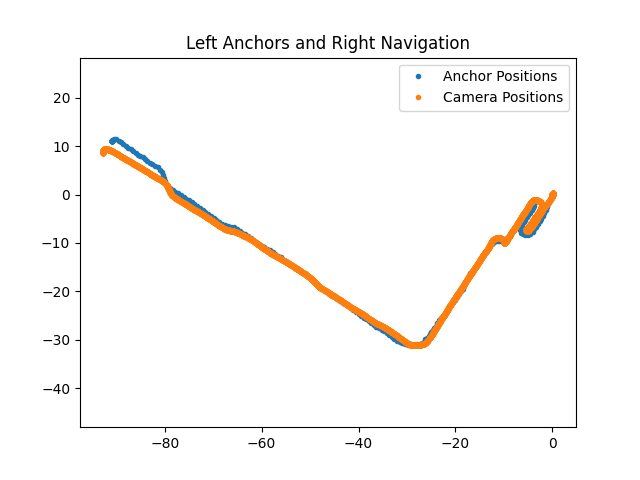
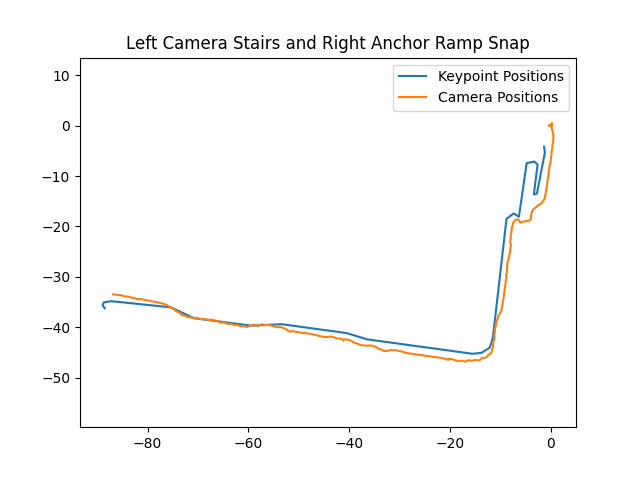

# Using ARGeoAnchors to navigate indoor + outdoor routes #
*written by: Richard Li and Ayush Chakraborty*

# Project Overview
[ARGeoAnchors](https://developer.apple.com/documentation/arkit/argeoanchor) are a new technology released by Apple designed to help "identify a geographic location using latitude, longitude, and altitude data." It additionally utilizes "imagery" to localize the user. All this to say, it uses the phone's camera and its GPS to express the phone's location in a way that is far more accurate that most other systems.

Unfortunately it's only active in a [few locations](https://developer.apple.com/documentation/arkit/argeotrackingconfiguration) -- thankfully, Boston is one of them, so we  were able to test a configuration of the Clew app that integrates ARGeoAnchors into its navigation instead of the currently used ARAnchors.

# Methodology
Clew currently localizes the user by directing the user to put their phone against a wall at the same place they put their phone when recording the route. This aligns the phone's current position with the previous map, localizing the phone and enabling navigation to occur.

Our branch, instead, localizes the user using Apple's ARGeoAnchor technology, which analyzes the user's GPS position and camera feed in order to lovalize them in terms of their latitudinal and longitudinal position. Then, as a user records a path, their latitude and longitude are saved over time as ARGeoAnchors, which can be reloaded into another session for other users to follow. 

## Initial test of ARGeoAnchors
During our first test of ARGeoAnchors, we visited the New England College of Optometry (NECO), where we recorded and navigated along several different routes. We found that the routes were fairly accurate, but the ARGeoAnchors sometimes drifted out of position and into the walls of the NECO on some routes. This is visualized below: 

This route was recorded while hugging the left wall of the NECO and then re-navigated while hugging the right wall. If the reloading of ARGeoAnchors was 100% accurate, we would expect the camera positions to consistenly be slightly right of the anchor positions. However, the graphic clearly shows a drift towards the end of the route, causing the anchors to be to the right of the user (directly in the wall).

## Snap-to-route testing
We hypothesized that the error in ARGeoAnchor reloading was caused by errors in estimating the user's orientation, causing a slight positional offset that is amplified as the path goes on. To correct this error, we implemented SnapToRoute, which implements an [iterative closest point](http://ais.informatik.uni-freiburg.de/teaching/ss11/robotics/slides/17-icp.pdf) approach to calculate a [transform](https://igl.ethz.ch/projects/ARAP/svd_rot.pdf) that best aligns one path onto another path. For our case, we operated under the assumption that an individual who is B/VI only needs assistance during a few keypoints along the route and is able to navigate down straight sections of a path on their own. Using this assumption, we "snap" the keypoints of the navigation route onto the route a user has already traversed to correct for any tracking errors. The results of the snap to route mechanism are showed below:

As seen by the graph, the snap to route effectively removed the drift of the ARGeoAnchors and allowed the user to navigate to the end of the route.

During further testing, we found that while snap to route did somewhat fix errors in aligment, there were still some inaccuracies, especially when the shapes of the navigation route did not closesly match the shape of the path that a user walked. An example of this is shown below:

## Weighting snap-to-route
Since the user's motion didn't exactly resemble the path they were supposed to follow (which mimics the real world situation of someone taking a wrong turn, or getting slightly lost while using Clew), the snap to route algorithm failed to fix the drift at the end of the route. For this reason, we chose to implement a "recency bias" in the snap to route algorithm, where it focuses on better aligning recent points in a user's motion as compared to initial points in navigation. This yielded better results during initial testing, as shown below:

# Timeline:

- 12/14/21: Initial kick-off meeting
- 12/14/21 - 1/26/22: Onboarding to Swift
- 2/9/22: Testing the test app at the New England College of Optometry + recording schemes for at-home test
- 2/9 - 4/1/22: Intial work on integrating ARGeoAnchors into Clew Maps, creating barebones framework for further testing
- 4/3/22: First test of Clew Maps (with ARGeoAnchors) on recorded schemes from the NECO
- 4/3 - 4/23/22: Bugfixes in code, trying to create workflow and evaluate factors affecting accuracy
- 4/23/22: Second test of Clew Maps in person at the NECO/
- 4/23 - 5/13/22: Further bugfixes + deciding on SnapToRoute as our solution for misalignment
- 5/28-6/1/22: Research begins, onboarding + learning about designing for accessibility
- 6/1 - 6/10/22: Implementation of STR
- 6/10 - : User interviews/feedback
Limitations:
1. ARGeoAnchors are only supported in a very small coverage area.
2. STR still uses magic numbers to determine its weighting system (while this isn't necessarily bad, dynamic calculation of an optimal weighting system would be nice to have)

User interviews + user testing || **TODO**:
1. List of potential users
- Users in ARGeoAnchor supported areas
- Users who regularly traverse a mix of outdoor and indoor locations/users who have to enter unfamiliar buildings.

2. List of failcases
To be identified with further testing.

# Credits: 

Special thanks to Paul Ruvolo for supporting us in our work through OCCaM lab. 

# Resources:
- https://developer.apple.com/documentation/arkit/argeoanchor
- Paul :P

## Further exploration:

- https://igl.ethz.ch/projects/ARAP/svd_rot.pdf (A simple mathematical explanation of our STR algorithm)
- http://ais.informatik.uni-freiburg.de/teaching/ss11/robotics/slides/17-icp.pdf (An explanation of what Iterative Closest Point is)