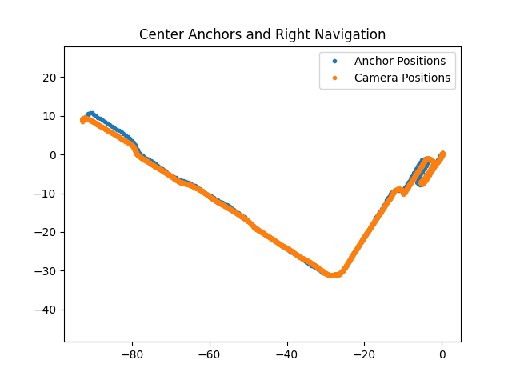
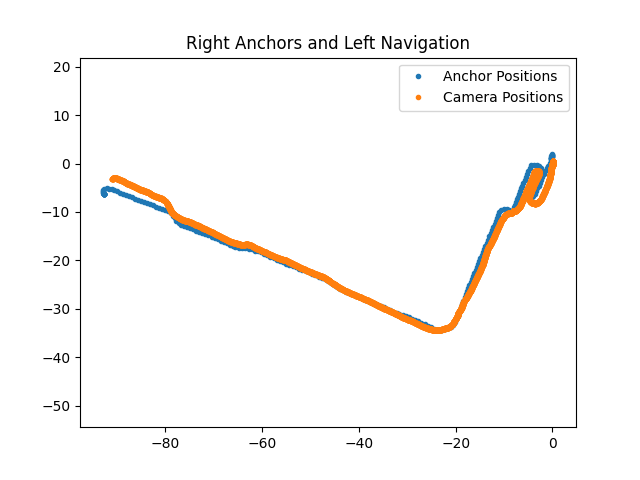
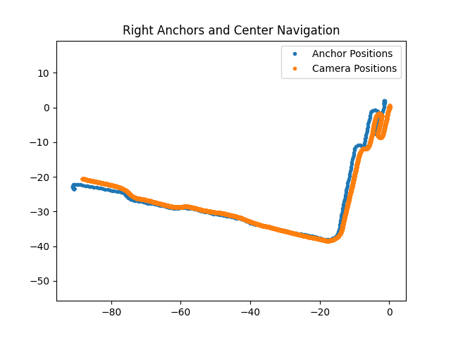
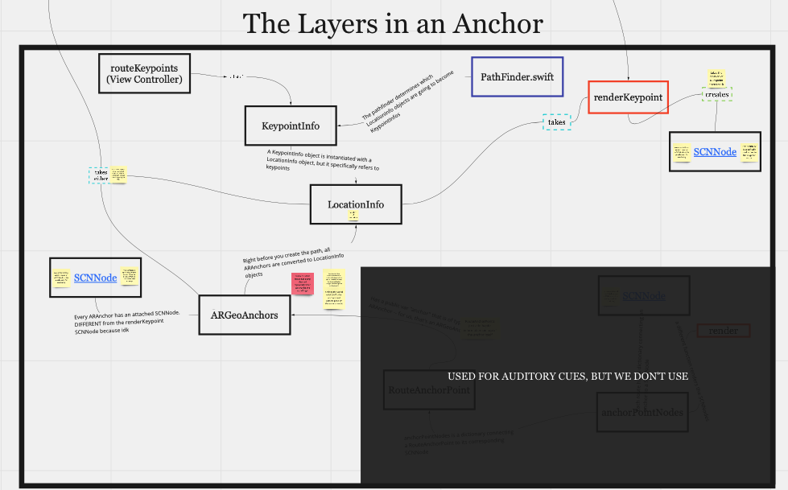
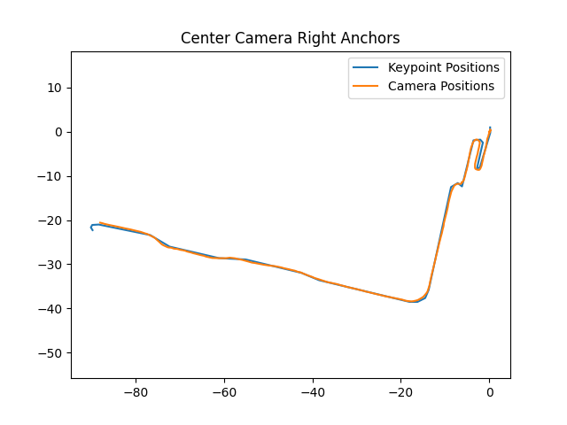

# Syntax:
Anchor --> refers to the ARGeoAnchors loaded in while performing navigation
Camera --> refers to the camera POSE of the phone currently navigating
STR --> snap-to-route

# 6/6/22 Benchmarking
The goal today is to identify the source of errors on our pathing. We can clearly see that the anchors drift into the wall. Does it appear to be an error in localization? (i.e. a single angle that can be fixed )

Noteworthy visualizations detailed below:
## Center Anchor Right Camera

This looks weird, almost like 2 different angles going on? The final stretch of the path looks like it has a different angle than the ramp part at the beginning. 

## Left Anchor Right Camera (1 + 2)

Same thing. Why is the end this awful? Maybe it's the tricky hallway in addition to low localization quality? Ran this twice to make sure it wasn't a fluke.

## Right Anchor Left Camera:

Again, we see a dramatic difference in the end of the route.

## Right Anchor Center Camera:

This somehow looks worse than the left camera one, even though R+L is objectively farther apart.

# 6/7/22 STR Testing:
Still trying to implement snap-to-route, finding a lot of difficulties determining what to snap. Ordered the geoanchors so that our visualizations could be a thinner line instead of massive points. 

Currently facing the following problem:
1. STR visually drags the keypoint to Narnia
2. The actual keypoint doesn't change. We still pass it normally, even though the keypoint gets dragged somewhere we can't see. 
3. STR's "optimal transform" has a *very large* translation component, even when that component shouldn't exist at all. 

**NOTE:** *After reverting to the commit at the end of yesterday, that translation component of the optimal transform is gone. No idea what we did there.*

Further understanding of how keypoints are rendered/what they're rendered from is necessary.

Testing the a route against its own anchors. Snap to route seems to visually change the keypoints, but it doesn't appear to change the underlying object telling us where to go. As soon as we cross the (now invisible) keypoint, it just places the original "next-keypoint", sans STR.

# 6/8/22
Did a [deep dive](https://miro.com/app/board/uXjVOut3Ah0=/) into the understanding of the architecture of an ARAnchor to help us understand what it is we need to change:

We decided to just make changes to the render-keypoint function and produced our first successful snap

A very exciting day!

# 6/9/22
Analyzed Clew data to see what kind of errors tend to crop up in users of Clew. Because STR kind of works, we want to begin protecting against potential fail cases. 

Came to the conclusion that a recency bias (in which closer points are valued more in determining the next snap as opposed to points that are farther away) would be the best thing to do.

Referencing [this paper](https://igl.ethz.ch/projects/ARAP/svd_rot.pdf) to determine how to implement that weighting, but it's a lot of complicated math and we're slowly working through it. 

# 6/10/22
Successfully added a system for weighting closer points far more heavily than points that are further away. 

The results are pretty nice!

*this is with the closest 25% of points being weighted 1000x more and the farthest 25% of points being weighted 0.001x* 

Note that the pictures we see are the final snap. The fact that the beginning of the route is off is an indicator that the weighting has worked and the algorithm is kind of "dismissing" the earlier points and valuing the closer points more. 

# 6/16/22
In-person testing at the NECO.

Seems to work. At least, we were unable to identify any situations in which the STR algorithm failed to better the path.

Note that we did find that STR crashed the application when attempting to record routes, so our solution was to simply reject the STR attempt if the app was currently recording. 
